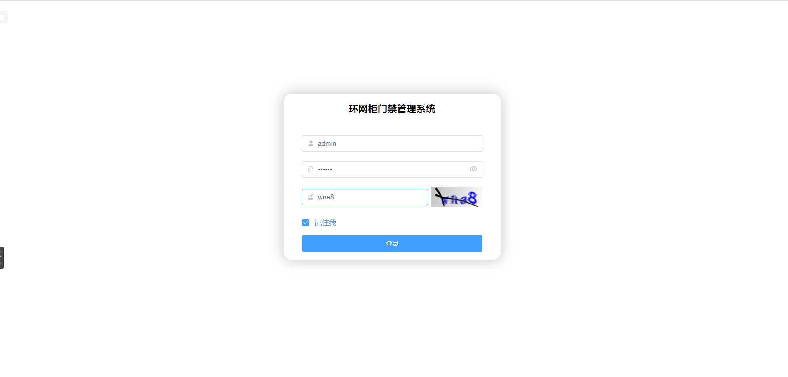
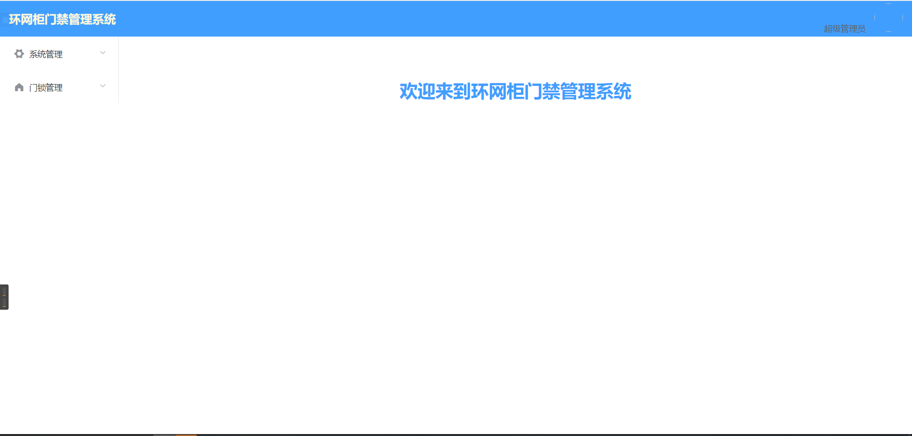
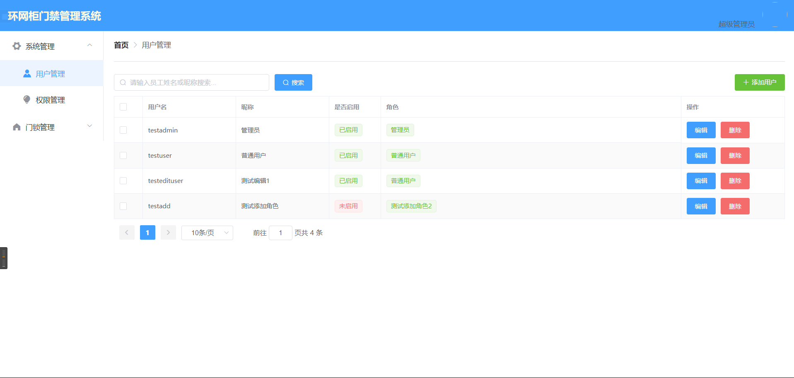
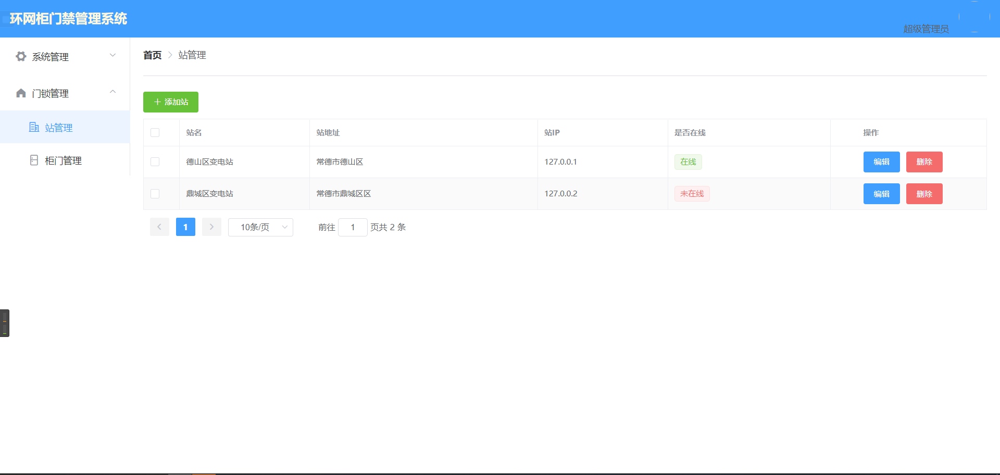
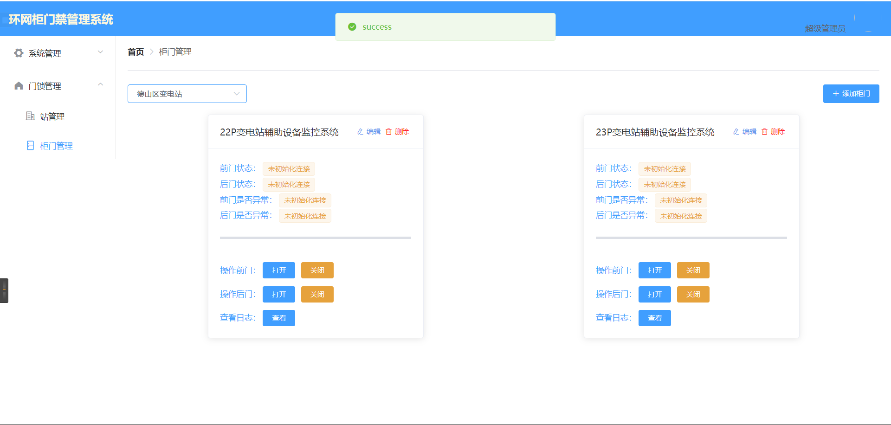
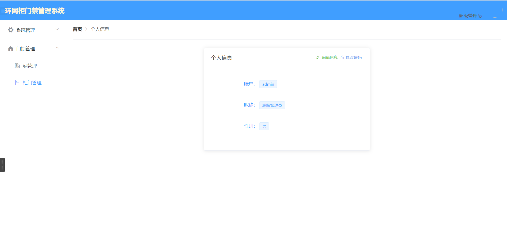

# door-lock

#### 介绍

基于变电站二次安措自动布置系统在每一块门锁中都安装智能通信模块，智能感知屏柜门状态并实时反馈至调度中心，调度中心远程控制屏柜门状态并根据实时反馈监控屏柜门日常运维状态。

#### 软件架构

该软件使用了前后端分离的架构，

前端使用的技术：vue、vuex、axios。

后端使用的技术：springboot、mybatisPlus、netty、websocket、springsecurity。

数据库：mysql、influxdb。

#### 安装教程

##### windows下安装

- **后端**

1. 将代码拷贝下来

2. doorlock后端代码由idea打开

3. 构建数据库

4. 在source文件夹下找到influxdb

5. 启动infludb的数据库创建数据库

   ```mysql
   create database doorlock
   ```

   

6. 打开commproxy通信转换软件连接上串口，再修改连接服务器端口9999，启动服务器后连接。

- **前端**

1. doorlock-ui由vscode打开

2. 安装node.js服务器

3. 在vue-config.js中把端口换成自己ip的，和DoorLockCabinet.vue中的websocket的url换成自己的ip

4. 安装依赖

   ```bash
   npm install
   ```

   

5. 启动服务器

   ```bash
   npm run serve
   ```

   

#### 使用说明

使用本代码记得更换里面的ip地址为自己本机的ip地址


#### 效果展示











